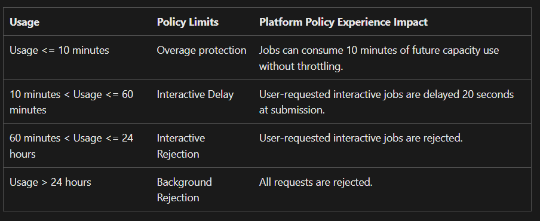

When using Microsoft Fabric, you're operating within a defined [Fabric Capacity](https://learn.microsoft.com/en-us/fabric/enterprise/licenses#capacity). But what happens when you hit its limits? In this blog post, I’ll walk you through how Fabric Capacity works, what happens when you exceed it, how to recover a capacity that’s become nearly unusable due to throttling, and what steps you can take to avoid hitting those limits in the future.

## What Is Fabric Capacity and How Does It Work?

Each capacity SKU in Microsoft Fabric defines a specific amount of available **Capacity Units (CU)**. For example:

- The **F2** SKU provides **2 CU**
- The **F256** SKU provides **256 CU**

Capacity Units are measured **per second**. So with an **F256**, you have access to **256 CU/s**, which translates to:

- 256 CU per second  
- 15,360 CU per minute  
- 921,600 CU per hour  
- 22,118,400 CU per day  
- 663,552,000 CU per 30 days  

Every artifact in Fabric — whether it’s a Spark Notebook, a Semantic Model query, or a Data Factory pipeline — consumes CU. For example, [every data movement in a Data Pipeline uses 1.5 CU-hours](https://learn.microsoft.com/en-us/fabric/data-factory/pricing-pipelines), which equals **5,400 CU-seconds**.

So, if you have a *Copy Data* activity (with no parallel throughput) running for 30 minutes, it will consume:

- `5400 * 0.5 hour = 2,700 CU-seconds`

This means it uses around **1.5 CU per second** over 30 minutes — or **75% of an F2 capacity** during that time.

> ℹ️ **Note:** I like to compare CU to **watts**. Just like electricity, where we’re billed by kilowatt-hours (kWh), CU in Fabric represents a rate of consumption.  
> Running a 1,000W appliance for 1 hour means you’ve used 1 kWh — similarly, using 1 CU for an hour equals **1 CU-hour**, or **3,600 CU-seconds**.

## How Can We Monitor Our Capacity?

Before diving deeper, it’s important to understand what’s happening inside your Fabric capacity.

To gain this visibility, I recommend using the [Fabric Capacity Metrics App](https://learn.microsoft.com/en-us/fabric/enterprise/metrics-app). This app provides detailed insights into your capacity usage — including:

- Which workloads and artifacts are consuming CUs  
- How much CU each operation is using  
- When peak usage and throttling events occur

Armed with this information, you can optimize workloads, isolate problematic operations, or plan capacity scaling — before the system becomes fully saturated.

## How Can We Go Over Capacity?

Exceeding your capacity is surprisingly easy — but it’s not always a problem. Microsoft Fabric includes mechanisms like **bursting** and **smoothing** to handle short-term overages gracefully.

In simple terms: you may temporarily consume more CU than your SKU allows — this is called **bursting**. Fabric will then **smooth** that excess usage over a 24-hour period, helping to avoid throttling from short-lived spikes.  
[You can read more about bursting and smoothing here.](https://learn.microsoft.com/en-us/fabric/enterprise/throttling#bursting)

If your usage remains high and goes beyond what smoothing can accommodate, you accumulate an **overage** — the amount of CU you’ve consumed beyond your allocated limit. These overages are automatically **burned down** (gradually subtracted) as soon as capacity becomes available again.

A brief overage isn’t necessarily a concern. However, if it continues for too long, Microsoft Fabric will begin **throttling** your workloads to protect the system.

When overages become substantial, workloads may be **throttled** or even **rejected** entirely. The table below outlines how throttling is applied. For example, "Usage > 24 hours" means you've consumed more CU than your total daily allocation — in that case, **all activities will be rejected** until the overage is sufficiently reduced.

  
*Source: [https://learn.microsoft.com/en-us/fabric/enterprise/throttling](https://learn.microsoft.com/en-us/fabric/enterprise/throttling)*

## We've Overloaded Our Capacity — Now What?

If your capacity is overloaded and throttling is in effect — with both interactive and background activities being rejected — you need to act quickly.

Start by identifying the cause. Was it an interactive workload (e.g., Power BI reports) or a background process (e.g., Spark Notebook or pipeline run)? If you're in a critical state, consider pausing non-essential workloads to allow the system to recover.

To resolve throttling and restore your capacity, you have three options:

### 1. **Wait It Out**

This is the simplest — but also slowest — option. You wait until the overage burns down naturally. Depending on the size of the overage and the smoothing period (e.g., a background workload burst), this may take **up to 24 hours**.

### 2. **Temporarily Increase Your Capacity SKU**

Upgrading your capacity (e.g., from **F32 to F64**) is almost instant. Once upgraded, your new capacity begins absorbing the overage. However, throttling will remain in place until the accumulated overage is cleared.

### 3. **Pause and Resume the Capacity**

Pausing and then resuming your capacity **resets** the overage and removes throttling immediately. This is a fast recovery method, but note:  
> 💰 **You will be charged** for any overage accumulated before the reset.

Use this option carefully, especially in production environments.

## Preventing Future Capacity Overloads

Once you’ve recovered, it’s time to ensure it doesn’t happen again. Start by analyzing what caused the overage, then consider the following preventative measures:

### Configure Your Spark Compute

The number of Spark vCores you can use is tied to your SKU. By default, you’re entitled to **2x CU in vCores** — for example, an **F64** gives you **128 vCores**.

However, Fabric allows **bursting up to 3x**, meaning a maximum of **384 vCores**.

To calculate your Spark environment’s usage:  
`(executor_cores × executors) + (cores per worker × workers)`

Configure your Spark environment so it doesn’t unintentionally consume your entire capacity.

### Use Autoscale Billing for Spark

If Spark usage is unpredictable or should not affect capacity at all, consider enabling [Autoscale Billing for Spark](https://learn.microsoft.com/en-us/fabric/data-engineering/autoscale-billing-for-spark-overview). This bills Spark usage **separately**, so it doesn't use CU from the main capacity pool. You can also set budget limits to manage cost.

### Enable Spark Job-Level Bursting Control

Disabling [job-level bursting](https://learn.microsoft.com/en-us/fabric/data-engineering/spark-job-concurrency-and-queueing) ensures that individual Spark jobs can’t monopolize your capacity. This allows for better concurrency, though multiple jobs can still collectively cause overloads.

### Use Surge Protection

With [surge protection](https://learn.microsoft.com/en-us/fabric/enterprise/surge-protection), you can restrict how much CU background jobs can consume — preserving enough capacity for interactive workloads to continue running without disruption.

### Upgrade Your Capacity SKU

Sometimes the simplest — though most expensive — solution is to move to a higher-tier SKU. If your workloads routinely exceed the limits of your current capacity, upgrading may be the best long-term fix.

## Conclusion

In this post, we explored how Microsoft Fabric Capacity works, how Capacity Units are calculated, what happens when you exceed your limits, and how throttling affects your workloads. We also looked at several ways to recover and — more importantly — how to prevent capacity overloads in the future.

If you have questions or additional recommendations, feel free to leave them in the comments below!
