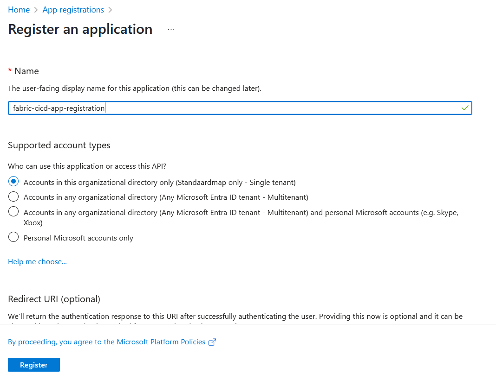
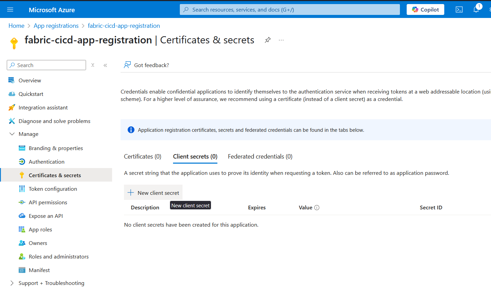
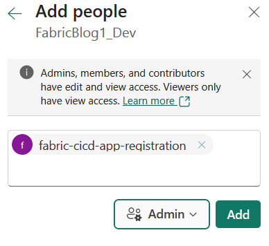

I'm currently working on a Microsoft Fabric solution that includes a custom Python library containing reusable code shared across our Notebooks. To manage deployments across our Development, Test, and Production environments, we're using Microsoft's [fabric-cicd](https://microsoft.github.io/fabric-cicd/latest/) framework.

To ensure our development teams always use the latest version of the Python library in the Development environment, we decided to automate its deployment to a [Microsoft Fabric Environment](https://learn.microsoft.com/en-us/fabric/data-engineering/create-and-use-environment) whenever a new version is pushed to our Git repository.

In this post, I’ll walk you through how we implemented this automation using GitHub Actions (or Azure DevOps), enabling fast, reliable updates across environments.

## In This Post

In this post, we’ll walk through the key steps to implement an automated Python wheel deployment to a Microsoft Fabric environment:

- Register an application (Service Principal) in the Azure Portal
- Grant the Service Principal admin access to your Fabric workspace
- Create a Python script that uses the Fabric API to upload the `.whl` file
- Set up a GitHub Action or Azure DevOps pipeline to automate the deployment

> ℹ️ **Note:** All code in this blogpost can be found in my [Github Repository](https://github.com/tom-keim/fabric-whl-upload/)
## Register an Application (Service Principal) in the Azure Portal

The first step is to create an [App Registration (Service Principal)](https://learn.microsoft.com/en-us/entra/identity-platform/app-objects-and-service-principals) in the Azure Portal. This Service Principal will allow our deployment pipeline to authenticate and access the Microsoft Fabric workspace.

To begin, open the Azure Portal and search for **"App registrations"**. Click **"Create"**, then enter the required details as shown below:



Once the app registration is created, you need to generate a client secret. Under **Manage → Certificates & secrets**, go to the **Client secrets** section and click **"New client secret"**:



Fill in the necessary details and create the secret. ⚠️ **Important**: Copy the client secret value and store it somewhere secure. It will not be visible again after you leave the page.

## Grant the Service Principal access to your Fabric workspace

Next, we need to grant the Service Principal access to your Microsoft Fabric workspace. In this example, we'll assign it **admin rights** at the workspace level to enable deployment permissions.

To do this:

1. Navigate to your Fabric workspace.
2. Click **Manage access** → **Add people or groups**.
3. Search for the name of your Service Principal (the name you used during App Registration).
4. Set the role to **Admin** and confirm to create the access rule.



# Create a Python Script to Upload the `.whl` File Using the Fabric API

Next, we’ll create a Python script that authenticates using the Service Principal and uploads the built `.whl` file to the Microsoft Fabric environment.

This script will perform the following tasks:

1. Import the required modules  
2. Authenticate with Azure AD using the Service Principal  
3. Retrieve an access token for the Fabric API  
and more

---

### ✅ Import Required Modules

We start by importing the necessary Python modules. If any of these are not already installed in your environment, install them with:

```bash
pip install requests
pip install azure-identity
```

Now import the modules:

```python
import os
import time
import urllib.parse
from pathlib import Path

import requests
from azure.identity import ClientSecretCredential
```

---

### 🔐 Get an Authentication Token

Next, we retrieve an access token using the Service Principal we created earlier. This token will be passed to the Fabric API to authorize the upload.

> 🚫 **Note**: Do not hard-code your credentials. You’ll pass the `client_id`, `client_secret`, and `tenant_id` later from GitHub Actions or Azure DevOps pipelines using environment variables or secrets.

We use the `ClientSecretCredential` class from the `azure-identity` library:

```python
def _get_fabric_api_token(client_id: str, client_secret: str, tenant_id: str) -> str:
    token_credential = ClientSecretCredential(
        tenant_id=tenant_id,
        client_id=client_id,
        client_secret=client_secret
    )
    token = token_credential.get_token("https://api.fabric.microsoft.com/.default")
    return token.token
```

### 🧩 Fabric API Requests

Next, we need a way to make API requests to the Microsoft Fabric API. To keep our code clean and reusable, we’ll build a single, generic method for making authenticated HTTP requests.

```python
def _fabric_api_request(request_type: str, token: str, request_url: str, files: dict | None = None, headers: dict | None = None, max_retries: int = 3) -> str:
    if headers is None:
        headers = {
            "Content-Type": "application/json",
        }
    headers["Authorization"] = f"Bearer {token}"

    request_url = f"https://api.fabric.microsoft.com/v1/{request_url.lstrip('/')}"
    for attempt in range(1, max_retries + 1):

        response = requests.request(
            request_type,
            request_url,
            headers=headers,
            files=files,
        )
        if response.status_code == 200:
            return response.json()

        if attempt < max_retries:
            time.sleep(3)
        else:
            msg = f"Fabric API request failed after {max_retries} attempts with status code {response.status_code}: {response.text}. URL: {request_url}"
            raise Exception(msg)
    return None
```

### 📥 Getting Fabric Environment Information

Before deploying the `.whl` file, we need to retrieve the current **state** of the target Fabric environment. This state indicates whether the environment is in a **published** (ready) state or if a previous deployment is still in progress.

If a deployment is currently running, we have the option to cancel it before proceeding with the new deployment. This ensures that we don't run into conflicts or overlapping operations.

```python
def _get_fabric_environment_state(token: str, workspace_id: str, environment_id: str) -> str:
    environment_details = _fabric_api_request(
        "GET", token, f"workspaces/{workspace_id}/environments/{environment_id}")
    try:
        return environment_details["properties"]["publishDetails"]["state"]
    except KeyError as e:
        msg = f"Incorrect API response {environment_details}"
        raise Exception(
            msg) from e

def _cancel_fabric_environment_publish(token: str, workspace_id: str, environment_id: str) -> None:
    _fabric_api_request("POST", token,
                        f"workspaces/{workspace_id}/environments/{environment_id}/staging/cancelPublish")
```

### 🔍 Retrieve Existing Custom Libraries

Before deploying a new `.whl` file, we first check which custom libraries are currently deployed in the Fabric environment. This allows us to detect and clean up any older versions of the same library.

The following function retrieves the list of currently deployed wheel files. If the environment is empty or unavailable, we safely return an empty structure:

```python
def _get_fabric_environment_custom_libraries(token: str, workspace_id: str, environment_id: str) -> dict:
    try:
        return _fabric_api_request("GET", token, f"workspaces/{workspace_id}/environments/{environment_id}/staging/libraries")
    except Exception:
        return {"customLibraries": {"wheelFiles": []}}
```

---

### 🧹 Delete Older Versions of the Custom `.whl` Library

To avoid version conflicts or clutter, we delete any previously deployed versions of the same wheel file. The logic below checks all deployed libraries, and if any file starts with the name of our package, it will be removed.

```python
def _delete_fabric_environment_custom_library(token: str, workspace_id: str, environment_id: str, library_name: str) -> dict:
    encoded_library_name = urllib.parse.quote(library_name)
    return _fabric_api_request("DELETE", token,
                               f"workspaces/{workspace_id}/environments/{environment_id}/staging/libraries?libraryToDelete={encoded_library_name}"
                               )


def _delete_fabric_environment_published_custom_libraries(token: str, workspace_id: str, environment_id: str, package_name: str) -> None:
    libraries = _get_fabric_environment_custom_libraries(
        token, workspace_id, environment_id)

    if "customLibraries" in libraries and "wheelFiles" in libraries["customLibraries"]:
        for library_name in libraries["customLibraries"]['wheelFiles']:
            if library_name.startswith(package_name):
                print(
                    f"Deleting custom library {library_name} from environment {environment_id}")
                # Delete the custom library
                _delete_fabric_environment_custom_library(
                    token, workspace_id, environment_id, library_name)
```

### 🚀 Upload the New `.whl` File and Start the Publish

Once the environment is ready and any previous versions of the library have been cleaned up, we can upload the new `.whl` file and initiate the publish process.

The first function uploads the wheel file to the Fabric environment’s staging area. The second function starts the publish process, which promotes the changes to the environment.

```python
def _upload_fabric_environment_custom_library(token: str, workspace_id: str, environment_id: str, file_path: str) -> None:
    file = Path(file_path)
    files = {'file': (Path(file_path).name, file.open('rb'))}

    _fabric_api_request("POST", token,
                        f"workspaces/{workspace_id}/environments/{environment_id}/staging/libraries",
                        files=files,
                        headers={}
                        )

def _publish_fabric_environment(token: str, workspace_id: str, environment_id: str) -> None:
    _fabric_api_request("POST", token,
                        f"workspaces/{workspace_id}/environments/{environment_id}/staging/publish"
                        )
    print(
        f"Environment {environment_id} publish started successfully. Waiting for it to finish...")
```


### ⏳ Wait Until the Fabric Environment Publish Completes

Publishing changes to a Fabric Environment can take a significant amount of time — in some cases, up to **25–30 minutes**. To handle this gracefully, we include logic to **poll the deployment status every 30 seconds** until it completes or a timeout is reached.

This ensures that our deployment process doesn't proceed prematurely while the environment is still updating. It also provides a clean way to detect and respond to failed or cancelled deployments.

```python
def _is_fabric_environment_published(token: str, workspace_id: str, environment_id: str, allow_cancelled: bool = False) -> bool:
    state = _get_fabric_environment_state(token, workspace_id, environment_id)
    if state == "Success":
        return True

    if state == "Failed" or (not allow_cancelled and state == "Cancelled"):
        msg = f"Environment {environment_id} failed to publish with state: {state}"
        raise Exception(
            msg
        )
    return False  # Else, the environment is not published yet


def _wait_until_fabric_environment_publish_finished(token: str, workspace_id: str, environment_id: str, allow_cancelled: bool = False, timeout_in_minutes: int = 40) -> bool:
    start_time = time.time()
    while True:
        if _is_fabric_environment_published(token, workspace_id, environment_id, allow_cancelled):
            print(f"Environment {environment_id} is published successfully.")
            return True
        if time.time() - start_time > timeout_in_minutes * 60:
            msg = f"Timeout reached while waiting for environment {environment_id} to be published"
            raise TimeoutError(
                msg
            )
        print("Waiting for environment to be published, checking again in 30 seconds...")
        time.sleep(30)  # Wait 30 seconds before checking again
```


### 🧩 Putting It All Together

Finally, we tie all the pieces together into a single script entry point. This block ensures that the full deployment process runs end-to-end.

At this stage, we retrieve the required environment variables for authentication and deployment:
- **Fabric Workspace ID**
- **Fabric Environment ID**
- **Tenant ID**
- **Client ID**
- **Client Secret**
- **File path to the `.whl` file**

These values will be passed into the script via environment variables from your **DevOps pipeline** or **GitHub Actions workflow**.

```python
def run_wheel_deployment_to_fabric(token: str, workspace_id: str, environment_id: str, file_path: str) -> None:
    try:
        # First, check if the environment is in published state
        if _get_fabric_environment_state(token, workspace_id, environment_id) != "Success":
            print("Cancelling earlier publish....")
            _cancel_fabric_environment_publish(
                token, workspace_id, environment_id)
            _wait_until_fabric_environment_publish_finished(
                token, workspace_id, environment_id, allow_cancelled=True)

        # We need to delete the custom libraries already in the environment
        package_name = Path(file_path).name.split('-')[0]
        _delete_fabric_environment_published_custom_libraries(
            token, workspace_id, environment_id, package_name)
        _upload_fabric_environment_custom_library(
            token, workspace_id, environment_id, file_path)

        _publish_fabric_environment(token, workspace_id, environment_id)

        _wait_until_fabric_environment_publish_finished(
            token, workspace_id, environment_id)

        print(
            f"Deployment of {file_path} to environment {environment_id} completed successfully.")
    except Exception as e:
        print(f"An error occurred during deployment: {e}")
        raise e

if __name__ == "__main__":
    CLIENT_ID = os.getenv("FABRIC_CLIENT_ID")
    CLIENT_SECRET = os.getenv("FABRIC_CLIENT_SECRET")
    TENANT_ID = os.getenv("FABRIC_TENANT_ID")
    WORKSPACE_ID = os.getenv("FABRIC_WORKSPACE_ID")
    ENVIRONMENT_ID = os.getenv("FABRIC_ENVIRONMENT_ID")
    FILE_PATH = os.getenv("FABRIC_FILE_PATH")

    if not all([CLIENT_ID, CLIENT_SECRET, TENANT_ID, WORKSPACE_ID, ENVIRONMENT_ID, FILE_PATH]):
        error_message = "One or more environment variables are not set."
        raise ValueError(error_message)

    token = _get_fabric_api_token(CLIENT_ID, CLIENT_SECRET, TENANT_ID)
    run_wheel_deployment_to_fabric(
        token, WORKSPACE_ID, ENVIRONMENT_ID, FILE_PATH)
```

## 🚀 GitHub Action Integration

Now that we’ve built the deployment script, we can run it from a **GitHub Action** (or an Azure DevOps pipeline). In this blog post, we'll focus on using **GitHub Actions**, but if you're using Azure DevOps, you can find the corresponding pipeline example in my [GitHub repository](https://github.com/tom-keim/fabric-whl-upload/).

---

### 🔐 Define Required Secrets

First, we need to configure the required credentials and environment-specific variables. In GitHub, go to your repository settings:

> **Settings → Security → Secrets and Variables → Actions**

Create the following **repository secrets**:

- **`FABRIC_CLIENT_ID`**: The client ID of your previously created Service Principal
- **`FABRIC_TENANT_ID`**: The tenant (directory) ID of your Azure AD instance
- **`FABRIC_CLIENT_SECRET`**: The secret value you stored when creating the Service Principal
- **`FABRIC_WORKSPACE_ID`**: The ID of the Fabric Workspace containing your environment (see note below)
- **`FABRIC_ENVIRONMENT_ID`**: The ID of the Fabric Environment you want to deploy to (see note below)

> ℹ️ **Note:**  
> You can find the **Workspace ID** and **Environment ID** directly in the URL when viewing the Fabric Environment in your browser.  
> The URL typically looks like:  
> `https://app.powerbi.com/groups/<workspace_id>/sparkenvironments/<environment_id>?experience=power-bi`  
> Copy the values for `<workspace_id>` and `<environment_id>` and use them in your GitHub secrets.

Next up, create an GitHub Action, and use the following code. This code will use Python's build module to build a new wheels file based on the python in the same repository. 

```yaml
### 🛠️ Create the GitHub Action Workflow

Next, create a GitHub Action workflow that automates the build and deployment of your Python wheel file to Microsoft Fabric.

The following workflow uses Python’s `build` module to generate a `.whl` file from your repository source code. It then finds the built file and triggers your deployment script.

Save this file as `.github/workflows/deploy.yml` in your repository:

```yaml
name: Deploy Wheels to Fabric

on:
  push:
    branches:
      - main

jobs:
  deploy:
    runs-on: ubuntu-latest
    steps:
      - name: Checkout repository
        uses: actions/checkout@v4

      - name: Set up Python 3.11
        uses: actions/setup-python@v5
        with:
          python-version: '3.11'

      - name: Install build and clean dist
        run: |
          python -m pip install --upgrade pip
          python -m pip install build
          python -m pip install requests
          python -m pip install azure-identity
          rm -rf ./dist

      - name: Build wheel
        run: |
          python -m build

      - name: Find wheel file
        id: find_wheel
        run: |
          WHEEL_FILE=$(find $(pwd)/dist -name "*.whl" -print -quit)
          echo "WHEEL_FILE=$WHEEL_FILE" >> $GITHUB_ENV
          echo "Wheel file path: $WHEEL_FILE"

      - name: Deploy wheel to Fabric
        env:
          FABRIC_TENANT_ID: ${{ secrets.FABRIC_TENANT_ID }}
          FABRIC_CLIENT_ID: ${{ secrets.FABRIC_CLIENT_ID }}
          FABRIC_CLIENT_SECRET: ${{ secrets.FABRIC_CLIENT_SECRET }}
          FABRIC_ENVIRONMENT_ID: ${{ secrets.FABRIC_ENVIRONMENT_ID }}
          FABRIC_WORKSPACE_ID: ${{ secrets.FABRIC_WORKSPACE_ID }}
          FABRIC_FILE_PATH: ${{ env.WHEEL_FILE }}
          PYTHONUNBUFFERED: '1'
        run: |
          python devops_pipelines/deploy_wheels_file_to_fabric.py
```

This action is triggered on every push to the `main` branch. It builds the wheel file, locates it, and uses your deployment script to upload and publish it to the configured Fabric Environment.


## ✅ Conclusion

And there you have it! With this setup, every new commit or pull request to the `main` branch will automatically trigger your pipeline, build a new wheel file, and deploy it to your Microsoft Fabric environment.

If you found this helpful, feel free to leave a comment below. If you run into any issues or have questions, you're welcome to reach out in the comments or connect with me on [LinkedIn](https://www.linkedin.com/in/tomkeim/) for further assistance.

